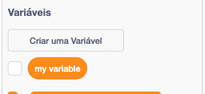
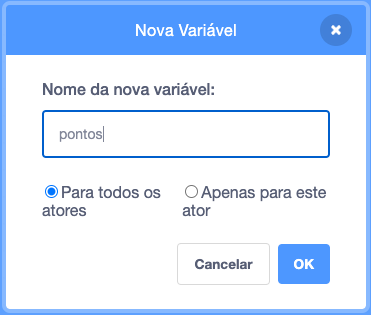
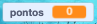

## Mantendo a pontuação

Para manter a pontuação de quantos peixes o jogador pega, você precisará de um local para armazenar a pontuação, uma maneira de adicioná-la e uma maneira de redefini-la quando o jogo for reiniciado.

Primeiro: guardar a pontuação!

\--- task \---

Vá para a categoria de blocos **Variáveis** e clique em **Criar uma Variável**.



Digite `Pontos` como o nome.



Confira sua nova variável!



\--- /task \---

## \--- collapse \---

## title: O que são variáveis?

Quando você deseja armazenar informações em um programa, você usa algo chamado **variável**. Pense nisso como uma caixa com uma etiqueta nela: você pode colocar algo, verificar o que está nela e mudar o que está nela. Você encontrará variáveis na seção **Variáveis** , mas você precisa criá-los primeiro para que apareçam lá!

\--- /collapse \---

Agora você precisa atualizar a variável sempre que o tubarão comer um peixe e redefini-la quando o jogo for reiniciado. Fazer as duas coisas é bem fácil:

\--- task \---

Da seção **Variáveis**, leve os blocos `mude [my variable v] para [0]`{:class="block3variables"} e `adicione [1] a [my variable v]`{:class="block3variables"}. Clique nas pequenas setas nos blocos, escolha `Pontos` da lista e, em seguida, coloque os blocos no seu programa:

### Código para o tubarão

```blocks3
    when green flag clicked
+    set [score v] to [0]
    set rotation style [left-right v]
    go to x: (0) y: (0)
```

### Código para o peixe

```blocks3
    if <touching [Sprite1 v] ?> then
+        change [score v] by [1]
        hide
        wait (1) secs
        go to x: (pick random (-240) to (240)) y: (pick random (-180) to (180))
        show
    end
```

\--- /task \---

Legal! Agora você tem uma pontuação e tudo mais.