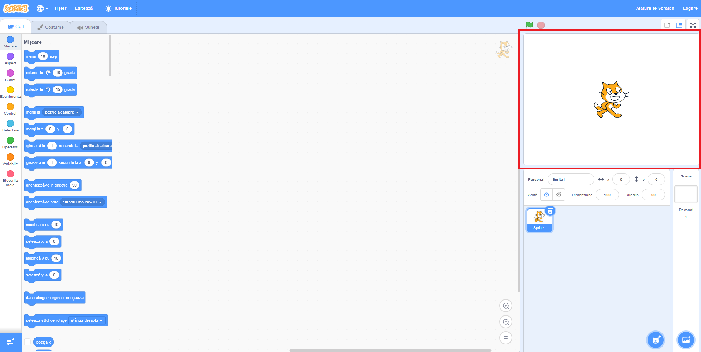
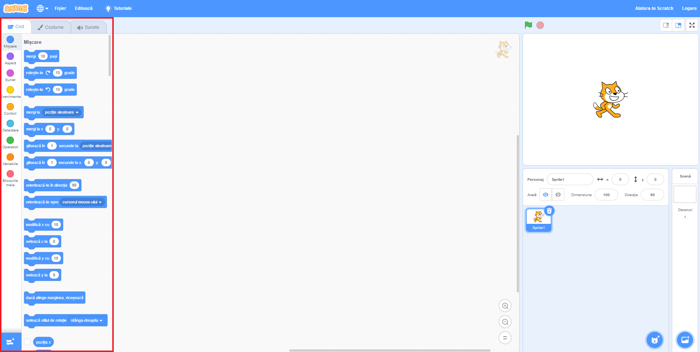
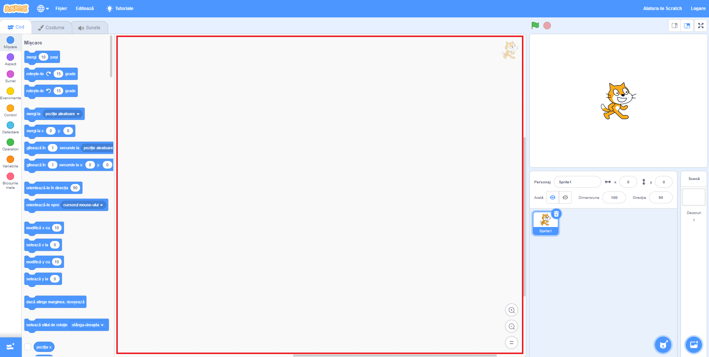
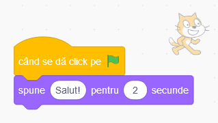

## Pregătire

După ce deschizi Scratch, vei vedea o fereastră ca cea de mai jos.

\--- task \---

Caută fiecare dintre următoarele elemente și memorează unde se află.

\--- /task \---

### Scena



## \--- collapse \---

## title: Ce este Scena?

Aici se execută programele Scratch. Conține:

* Unul sau mai multe **decoruri** \(imagini pe fundalul ecranului\)

* **Blocurile de cod** asociate \(vom explica mai târziu\)

\--- /collapse \---

### Lista de personaje


## \--- collapse \---

## title: Ce este un personaj?

Orice element ce poate fi pus pe Scenă este un **personaj**.

Un personaj este compus din:

* **Imaginea** sa de pe scena
* **Costumele** \(aspecte\) pe care le are în plus
* **Sunetele** pe care le poate scoate
* **Blocurile de cod** asociate 

\--- /collapse \---

### Secțiunea cu blocuri de cod



## \--- collapse \---

## title: Blocuri de cod

În Scratch, codul este reprezentat de blocuri pe care le poți conecta pentru a crea programe. Poți alege blocuri din **secțiunea de blocuri de cod**, le poți aduce în **panoul personajului curent** și apoi le poți conecta între ele.

Sunt zece categorii de blocuri. Acestea sunt culorate diferit și pot fi alese apasând pe elementele din partea de sus a **secțiunii cu blocuri de cod**.

\--- /collapse \---

### Panoul personajului curent



## \--- collapse \---

## title: Cine este personajul curent?

**Personajul curent** este cel care este selectat în **lista de personaje**.

**Panoul personajului curent** este zona in care poți vedea codul, costumele și sunetele personajului selectat.

\--- /collapse \---

E timpul să scriem cod!

\--- task \---

În lista de personaje, dă click pe Pisica Scratch. Acum pisica este personajul curent.

Alege categoria **Evenimente** din secțiunea cu blocuri de cod, apasă pe `când se dă click pe stegulețul verde`{:class="block3events"} și trage-l până în panoul poersonajului curent.

```blocks3
    when green flag clicked
```

\--- /task \---

\--- task \---

Apoi, alege **Aspect** din secțiunea cu blocuri de cod și caută acest bloc:

```blocks3
    say [Hello!] for (2) secs
```

Apasă pe el, ține butonul apăsat, apoi trage-l până în panoul personajului curent și dă drumul butonului.

\--- /task \---

\--- task \---

Acum că cel de-al doilea bloc se află în panoul personajului curent, conectează-l la partea de jos a primului bloc, apăsând pe el și mutându-l sub el până când se fixează împreună, în felul acesta:



\--- /task \---

\--- task \---

Now click the **Green Flag** to start your program and watch what happens!

\--- /task \---