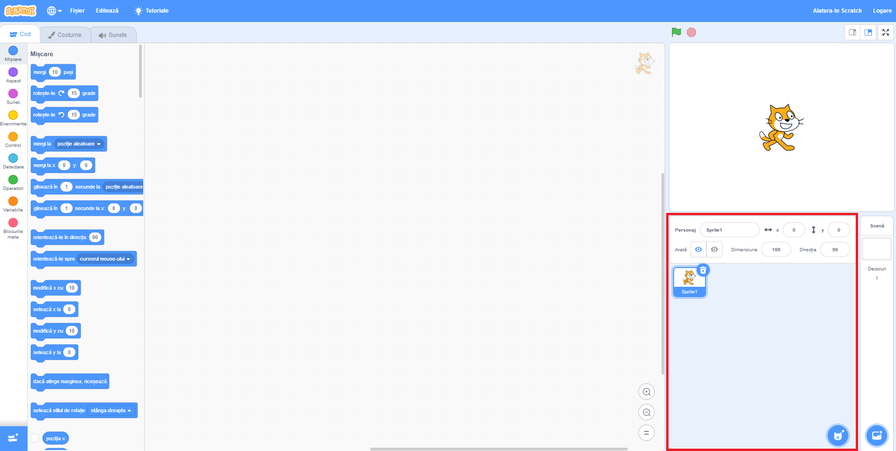

## Pregătire

După ce deschizi Scratch, vei vedea o fereastră ca cea de mai jos.

\--- task \--- Caută fiecare dintre următoarele elemente și memorează unde se află. \--- /task \---

### Scena


## \--- collapse \---

## title: Ce este Scena?

Aici se execută programele Scratch. Conține:

* Unul sau mai multe **decoruri** \(imagini pe fundalul ecranului\)

* **Blocurile de cod** asociate \(vom explica mai târziu\)

\--- /collapse \---

### Lista de personaje



## \--- collapse \---

## title: Ce este un personaj?

Orice element ce poate fi pus pe Scenă este un **personaj**.

Un personaj este compus din:

* **Imaginea** sa de pe scena
* **Costumele** \(aspecte\) pe care le are în plus
* **Sunetele** pe care le poate scoate
* **Blocurile de cod** asociate 

\--- /collapse \---

### Secțiunea cu blocuri de cod


## \--- collapse \---

## title: Blocuri de cod

În Scratch, codul este reprezentat de blocuri pe care le poți conecta pentru a crea programe. Poți alege blocuri din **secțiunea de blocuri de cod**, le poți aduce în **panoul personajului curent** și apoi le poți conecta între ele.

Sunt zece categorii de blocuri. Acestea sunt culorate diferit și pot fi alese apasând pe elementele din partea de sus a **secțiunii cu blocuri de cod**.

\--- /collapse \---

### Panoul personajului curent


## \--- collapse \---

## title: Cine este personajul curent?

**Personajul curent** este cel care este selectat în **lista de personaje**.

**Panoul personajului curent** este zona in care poți vedea codul, costumele și sunetele personajului selectat.

\--- /collapse \---

E timpul să scriem cod!

\--- task \--- În lista de personaje apasă pe Pisica Scratch. Acum pisica este personajul curent.

Alege categoria **Evenimente** din secțiunea cu blocuri de cod, apasă pe `când se dă click pe stegulețul verde`{:class="block3events"} și trage-l până în panoul poersonajului curent.

```blocks3
    când se face click pe stegulețul verde
```

\--- /task \---

\--- task \--- Apoi alege **Aspect** secțiunea cu blocuri de cod și caută acest bloc:

```blocks3
    say [Hello!] for (2) secs
```

Click on it, hold down the mouse button, and then just drag it into the current sprite panel and let go of the button.

\--- /task \---

\--- task \--- Now that the second block is in the current sprite panel, connect it to the bottom of the first block by clicking and dragging it again to move it below the other block until they snap together, like this:

 \--- /task \---

\--- task \--- Now click the **Start Program** button and watch what happens! \--- /task \---