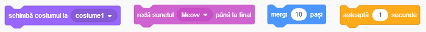
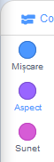
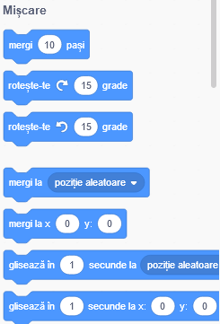
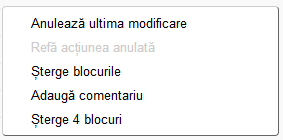

## Adăugarea și ștergerea blocurilor de cod

Grozav! Ai scris primul tău program Scratch. Acum e timpul să înveți ceva mai mult despre adăugarea si ștergerea codului în Scratch! Codul Scratch este alcătuit din **blocuri** ca acestea:



Toate blocurile pot fi găsite în **secțiunea cu blocuri de cod**, grupate în diferite categorii, în funcție de ceea ce fac.

## \--- collapse \---

## title: Utilizarea blocurilor din diferitele categorii

Apasă pe numele unei categorii pentru a vedea blocurile din categoria respectivă. Aici este selectată categoria **Mișcare**:



Toate blocurile din categoria selectată sunt afișate într-o listă:



Poți apăsa pe blocul dorit, apoi îl poți trage până în panoul personajului curent și să îi dai drumul. Odată ce se află în panou, îl poți mișca și conecta la alte blocuri.

\--- /collapse \---

Dacă vrei să vezi ce face un anumit bloc, poți să dai click de două ori pe el iar acesta se va executa!

\--- task \---

Încearcă să dai click de două ori pe unele blocuri pentru a vedea ce fac.

\--- /task \---

## \--- collapse \---

## title: Executarea codului

De obicei, vei vrea ca codul tău să fie executat automat ori de câte ori se întâmplă un anumit eveniment. De aceea multe dintre programele tale vor începe cu un bloc din categoria **Evenimente**, cel mai adesea acesta:

```blocks3
    when green flag clicked
```

Blocurile de cod conectate la acest bloc vor fi executate după ce este apasat **steagul verde**.

Blocurile de cod sunt executate pe rând de sus în jos, deci ordinea în care blocurile sunt așezate este importantă. În acest exemplu, personajul va `spune`{:class="block3looks"} `Salut!` înainte să `redea sunetul`{:class="block3sound"} `miau`.

```blocks3
    when green flag clicked
    say [Hello]
    play sound [meow v]
```

\--- /collapse \---

Este ușor să elimini sau să ștergi blocuri de cod pe care nu le vrei în programul tău! Este de ajuns să le tragi înapoi in secțiunea cu blocuri de cod.

**Atenție:** când un bloc este tras pana în secțiunea cu blocuri de cod toate blocurile conectate la acesta vor fi șterse împreuna cu el, așa ca ai grija să separi blocurile pe care vrei sa le ștergi de cele pe care vrei sa le păstrezi. Dacă ai șters unele blocuri de cod din greșeală și vrei să le recuperezi, poți să dai click dreapta și apoi să alegi opțiunea **Anulează ultima modificare**.



\--- task \---

Înearcă să adaugi, să ștergi și să recuperezi câteva blocuri de cod!

\--- /task \---

### Să recapitulăm ce am învățat

Acum că știi cum să muți codul pentru a face lucruri să se întâmple, este timpul să creezi un program care să facă Pisica Scratch să se miște în cerc!

\--- task \---

Asigură-te că personajul pisică este selectat în lista de personaje și trage următoarele blocuri până în panoul personajului curent și conectează-le între ele. Le poți găsi în listele **Evenimente** și **Mișcare**.

```blocks3
    when green flag clicked
    move [10] steps
```

\--- /task \---

\--- task \---

Acum apasă pe steagul verde de deasupra Scenei.


\--- /task \---

Ar trebui să vezi pisica mergând în linie dreaptă... nu e chiar ceea ce vrem, nu?

Notă: dacă apeși pe steag de prea multe ori și pisica merge prea departe, o poți trage înapoi!

\--- task \---

Adaugă blocul de rotire la sfârșit pentru a face pisica să se miște în cerc. Îl poți găsi tot în lista **Mișcare**.

```blocks3
    when green flag clicked
    move [10] steps
+    turn cw (15) degrees
```

\--- /task \---

## \--- collapse \---

## title: Cum funcționează rotirea?

Acest bloc face ca personajul să se rotească 15 grade din cele 360 care formează un cerc. Poți modifica acest număr și numărul de pași, apăsând pe ele și introducând o altă valoare.


\--- /collapse \---

\--- task \---

Acum, salvează-ți munca!

\--- /task \---