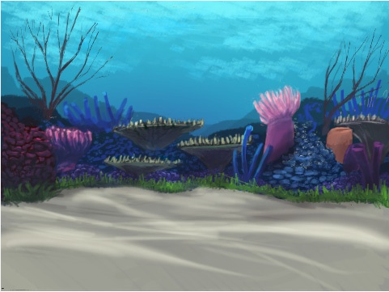

## Pregătirea scenei

Scratch are o bibliotecă de fundaluri și personaje pe care le poți folosi pentru a-ți face proiectul să arate bine.

\--- task \--- Selectează scena.

Apasă pe **Decoruri**.

Apasă pe butonul **Alege un Decor**.

Apoi alege fundalul subacvatic pe care îl preferi!

 \--- /task \---

Grozav! Desigur, acum ai o pisică sub apă, iar pisicilor nu prea le place apa. Însă poți rezolva asta, deoarece poți transforma pisica într-un rechin!

\--- task \--- Întâi, selectează personajul pisică și apasă pe butonul **Costume**.

Apoi, apasă pe **Alege un costum**

Selectează această imagine cu un rechin și apasă **OK**.

Acum, șterge costumele pisicii selectând-ul pe fiecare dintre ele și apăsând **x**.

 \--- /task \---

Acum ai un rechin – excelent!