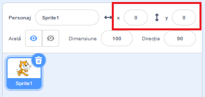

## Mișcarea elementelor

În momentul de față, rechinul tău se mișcă în cerc și ar fi mult mai distractiv să fie controlat cu tastele săgeți. În acest card, vei învăța cum să faci asta!

--- task ---

Începe prin a șterge tot codul pe care îl ai pentru rechin.

--- /task ---

După cum probabil ai ghicit, vei avea nevoie de blocuri **Evenimente** și **Mișcare** din nou!

--- task ---

De data aceasta, caută acest bloc și trage-l în panoul personajului curent:

```blocks3
    when [space v] key pressed
```

Apasă pe săgeata mică (▼) de lângă `spațiu`. Vei vedea o listă a tuturor butoanelor din care care poți alege.

--- /task ---

Vei avea nevoie de patru blocuri `când tasta este apăsată`{:class="block3events"} — câte una pentru fiecare dintre tastele săgeată.

--- task ---

Pentru a face rechinului să se miște, conectează aceste blocuri la blocuri **Mișcare** astfel:

```blocks3
    when [left arrow v] key pressed
    move (-10) steps
```

```blocks3
    when [right arrow v] key pressed
    move (10) steps
```

```blocks3
    when [up arrow v] key pressed
```

```blocks3
    when [down arrow v] key pressed
```

--- /task ---

**Notă**: `-10` înseamnă „mergi 10 pași în spate”.

--- task ---

Acum apasă pe steagul verde pentru a testa codul.

--- /task ---

Acum, rechinul se mișcă înainte și înapoi, ceea ce e destul de tare, dar nu se mișcă în sus sau în jos. De asemenea, dacă te uiți la blocurile **Mișcare**, vei vedea că nu există blocuri pentru „sus” sau „jos”. În schimb, sunt multe legate de coordonatele **x** și **y** — hai să le încercăm!

--- task ---

Ia două blocuri `modifică y cu` și schimbă-ți codul să arate așa:

```blocks3
    when [up arrow v] key pressed
+     change y by (10)
```

```blocks3
    when [down arrow v] key pressed
+     change y by (-10)
```

--- /task ---

Acum, când apeși tastele săgeată, rechinul se mișcă peste tot pe scenă!

--- collapse ---
---
title: Cum funcționează coordonatele x și y?
---

Când vorbim despre pozițiile obiectelor, cum ar fi personajele, folosim adesea coordonatele x și y. **Axa x** a Scenei se întinde de la **stânga la dreapta**, iar **axa y** de **jos în sus**.


Un personaj poate fi localizat prin coordonatele centrului său, de exemplu `(15, -27)`, unde `15` este poziția sa de-a lungul axei x, și `-27` poziția sa de-a lungul axei y.

+ Pentru a înțelege mai bine cum funcționează acest lucru, selectează un personaj și folosește comenzile **x** și **y** pentru a îl deplasa în interiorul scenei, setând diferite valori pentru coordonate.



+ Încearcă diferite perechi de valori pentru a vedea unde merge personajul! În Scratch, axa x merge de la `-240` la `240`, iar axa y merge de la `-180` la `180`.

--- /collapse ---

### Repornirea jocului

Rechinul se poate mișca pe tot ecranul acum, dar imaginează-ți că acesta este un joc: cum îl repornești și ce se întâmplă la începutul fiecărui joc?

Trebuie să muți rechinul la poziția sa inițială când jucătorul începe jocul. Ei vor începe jocul apasând pe steagul verde, deci trebuie să schimbi coordonatele x și y ale rechinului când se întâmplă acest lucru.

Acest lucru e destul de ușor! Centrul scenei este `(0, 0)` în coordonate `(x, y)`.

Deci, tot ce ai nevoie este un bloc **Eveniment** pentru steagul verde si un bloc **mergi la** de la **Mișcare**.

--- task ---

Trage un bloc `când se dă click pe steagul verde`{:class="block3events"} de la **Evenimente** până în panoul personajului curent.

```blocks3
    when green flag clicked
```

Apoi caută blocul `mergi la`{:class="block3motion"} de la **Mișcare** și atașează-l la blocul **Eveniment** pentru steag.

```blocks3
    when green flag clicked
+     go to x: (0) y: (0)
```

Setează coordonatele `x` și `y` la `0` în blocul `mergi la`{:class="block3motion"} dacă nu sunt deja `0`.

--- /task ---

--- task ---

Acum apasă pe steagul verde: ar trebui să vezi cum rechinul se întoarce în centrul scenei!

--- /task ---