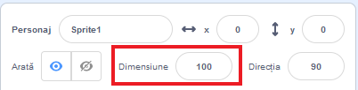
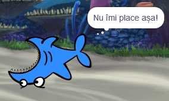

## Toate personajele

Acum ai un rechin pe care îl poți mișca folosind tastele săgeți. Frumos! E timpul să adaugi niște pești pe care să îi prindă.

\--- task \---

Apasă pe butonul **Alege un personaj** și alege un pește în ecranul care se deschide.


Dacă peștele e prea mare față de rechin poți să folosești căsuța pentru dimensiune pentru a îi face să aibă dimensiunile potrivite!



Modifică numărul din căsuța pentru dimensiune pentru a face personajul mai mare sau mai mic.

\--- /task \---

Grozav! Mai târziu, vei adăuga niște cod pentru a face peștele să se miște singur, fără ajutor din partea jucătorului. Jucătorul tău va mișca rechinul și va încerca să prindă peștele.

## \--- collapse \---

## title: Ce se întâmplă cu rechinul când se mișcă cu spatele?

Arată cam puțin ciudat ca rechinul să înoate înapoi. Așa cum în mod normal te întorci înapoi in loc să mergi cu spatele, rechinul ar trebui să se întoarcă în loc să înoate cu spatele. Din fericire pentru tine, Scratch are un bloc pentru asta!

Blocul `orientează-te în direcția`{:class="block3motion"} îți permite să alegi direcția în care să fie îndreptat personajul. Îl poți găsi în secțiunea de blocuri **Mișcare**. Poți introduce orice număr de grade, pentru a orienta personajul în orice direcție vrei.

\--- /collapse \---

\--- task \---

Grab a couple of copies of the `point in direction`{:class="block3motion"} block from the **Motion** list and connect them to your shark's code, like this:

```blocks3
    when [left arrow v] key pressed
+     point in direction (-90)
    move (10) steps
```

```blocks3
    when [right arrow v] key pressed
+     point in direction (90)
    move (10) steps
```

\--- /task \---

\--- task \---

Change the number of steps in the `move`{:class="block3motion"} blocks from `-10` to `10`.

If you try moving the shark around now after you've added the `point in direction`{:class="block3motion"} blocks, you might notice something a little strange happening. The shark may not be turning quite right!



\--- /task \---

## \--- collapse \---

## title: De ce se întoarce cu capul în jos?

The problem here is that the shark sprite started, as all sprites do, with the 'all around' **rotation style**, and what you need it to have is the 'left-right' style.

As usual, there’s a block for that, and it’s in **Motion**!

\--- /collapse \---

\--- task \---

Look in the **Motion** category for the block `set rotation style`{:class="block3motion"}.

Add the block to your shark reset code from earlier, and set the rotation style to `left-right`{:class="block3motion"}, like this:

```blocks3
    when green flag clicked
+     set rotation style [left-right v]
    go to x: (0) y: (0)
```

\--- /task \---