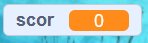

## Memorarea scorului

Pentru a ține minte câți pești a prins jucătorul ai nevoie de un loc în care să îl stochezi, o metodă de a adăuga la el și o metodă de a îl reseta atunci când se repornește jocul.

Primul lucru: stocarea scorului!

--- task ---

Dechide categoria de blocuri **Variabile** și apasă pe **Creează o variabilă**.


Introdu `scor` în căsuța nume.


Uită-te la noua ta variabilă!



--- /task ---

--- collapse ---
---
title: Ce sunt variabilele?
---

Când vrei să stochezi informații într-un program, vei folosi ceva numit **variabilă**. Te poți gândi la ea ca la o cutie care are o eticheta pe ea: poți pune ceva în ea, poți verifica ce este în ea și poți schimba ce e în ea. Vei găsi variabile în secțiunea **Variabile**, dar trebuie să le creezi mai întâi pentru ca acestea să apară acolo!

--- /collapse ---

Acum trebuie să modifici variabila ori de câte ori rechinul mănâncă un pește și să o resetezi atunci când jocul este repornit. Ambele lucruri sunt ușor de făcut:

--- task ---

Din secțiunea **Variabile**, ia blocurile `setează [variabila mea] la [0]`{:class="block3variables"} și `modifică [variabila mea] cu [1]`{:class="block3variables"}. Apasă pe săgețile mici din interiorul blocurilor, alege `scor` din listă și apoi pune blocurile în programul tău:

### Cod pentru rechin

```blocks3
    when green flag clicked
+    set [scor v] to [0]
    set rotation style [left-right v]
    go to x: (0) y: (0)
```

### Cod pentru pește

```blocks3
    if <touching [Sprite1 v] ?> then
+        change [scor v] by [1]
        hide
        wait (1) secs
        go to x: (pick random (-240) to (240)) y: (pick random (-180) to (180))
        show
    end
```

--- /task ---

Super! Acum ai și scor.