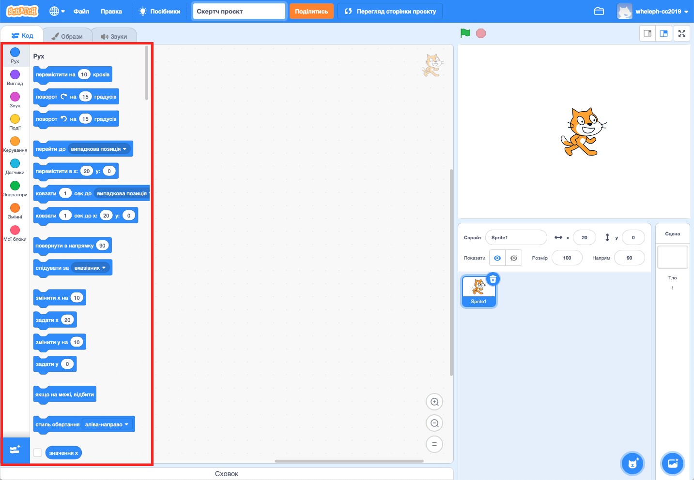

## Знайомство із середовищем

--- task ---

Відкрий [стартовий проєкт у Скретчі](https://rpf.io/scratch-new){:target="_blank"}. Скретч відкриється у новій вкладці браузера.

[[[working-offline]]]

--- /task ---

Як тільки ти відкриєш Скретч, то побачиш вікно, схоже на те, що показане нижче.

--- task ---

Знайди кожну із наступних областей і запам’ятай, де вони знаходяться.

--- /task ---

### Сцена


--- collapse ---
---
title: Що таке Сцена?
---

Тут запускаються твої програми на Скретчі. Вона має:

* Одне або декілька зображень, які будуть служити **тлом** \(зображення на задньому плані екрана\)

* Будь-які **блоки коду** пов'язані з ним \(до цього ми ще дійдемо\)

--- /collapse ---

### Список спрайтів


--- collapse ---
---
title: Що таке спрайт?
---

Будь-який об’єкт, який ти можеш додати до Сцени, є **спрайтом**.

Спрайт у себе включає:

* **Зображення** на Сцені
* Будь-які додаткові **образи** \(зовнішній вигляд\), які в нього є
* Будь-які **звуки**, пов’язані з ним
* Будь-які **блоки коду**, пов'язані з ним 

--- /collapse ---

### Палітра блоків коду



--- collapse ---
---
title: Блоки коду
---

Код у Скретчі являє собою блоки, які між собою з’єднуються для створення програм. Ти можеш вибирати блоки із **палітри блоків коду**, перетягувати їх на **панель поточного спрайта**, а далі з’єднувати їх одне з одним.

Існує десять категорій блоків. Вони позначаються різними кольорами, і ти можеш вибирати між ними, натискаючи на елементи списку вгорі **палітри блоків коду**.

--- /collapse ---

### Панель поточного спрайта


--- collapse ---
---
title: Що таке поточний спрайт?
---

**Поточним спрайтом** є спрайт, який було вибрано в **списку спрайтів**.

На **панелі поточного спрайта** ти можеш бачити код, образи та звуки для вибраного спрайта.

--- /collapse ---

Час розпочати кодування!

--- task ---

У списку спрайтів вибери Скретч-кота. Цей кіт зараз є поточним спрайтом.

Вибери категорію **Події** на палітрі блоків коду, натисти на блок `коли прапор натиснуто`{:class="block3events"} і перетягни його на панель поточного спрайта.

```blocks3
    when green flag clicked
```

--- /task ---

--- task ---

Далі перейди у **Вигляд** у палітрі блоків коду і знайди цей блок:

```blocks3
    say [Привіт!] for (2) secs
```

Клікни по ньому, затримай кнопку мишки, а потім просто перетягни його на панель поточного спрайта і відпусти кнопку.

--- /task ---

--- task ---

Тепер, коли другий блок знаходиться на панелі поточного спрайта, приєднай його до нижнього краю першого блоку, перетягнувши його під інший блок так, щоб вони з’єдналися:


--- /task ---

--- task ---

Тепер натисни на **зелений прапор**, щоб запустити програму, і спостерігай!

--- /task ---