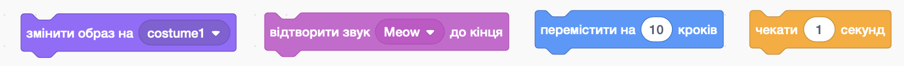
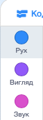
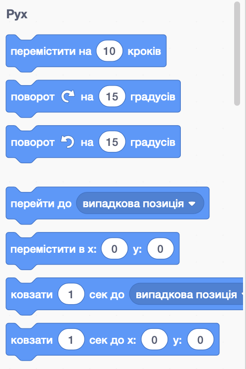
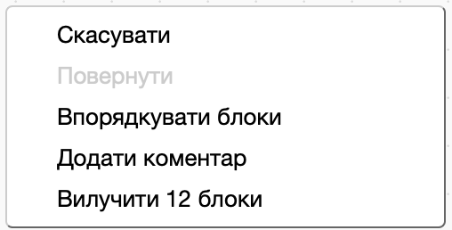

## Додавання і видалення блоків коду

Чудово! Ти створив(-ла) свою першу програму на Скретч. Настав час дізнатися трохи більше про кодування на Скретч! Код Скретч складається з **блоків**, схожих на ці:



Ти зможеш знайти всі блоки на **палітрі блоків коду**, де вони відсортовані за різними категоріями, залежно від їхнього призначення.

## \--- collapse \---

## title: Використання блоків з різних категорій

Клікни назву категорії, щоб переглянути всі її блоки. Тут вибрано категорію **Рух**:



Усі блоки із вибраної категорії відображаються в списку:



Ти можеш клікнути на потрібний блок, а потім просто перетягти його на панель поточного спрайта й відпустити. Коли він знаходиться на цій панелі, ти можеш рухати його і з’єднувати з іншими блоками.

\---collapse\---

Якщо ти хочеш побачити, що робить блок, клікни його двічі, щоб запустити!

\--- task \---

Спробуй зробити подвійний клік по деяким блокам коду, щоб побачити, що вони роблять.

\--- /task \---

## \--- collapse \---

## title: Запуск коду

Зазвичай твій код має запускатися автоматично, коли відбувається якась конкретна подія. Саме тому багато з твоїх програм починатимуться з блоків категорії **Події**, найчастіше з цього:

```blocks3
    коли ⚑ натиснуто
```

Блоки коду, що з ним з’єднані, запускатимуться після того, як буде натиснуто на **зелений прапор**.

Блоки коду запускаються згори вниз, тобто порядок, у якому ти приєднуєш блоки одне до одного, має значення. У цьому прикладі спрайт буде `говорити`{:class="block3looks"} `Привіт!` перед тим, як `відтворить`{:class="block3sound"} звук `Няв`.

```blocks3
    коли ⚑ натиснуто
  говорити [Привіт]
  відтворити звук [Няв v]
```

\--- /collapse \---

Видаляти непотрібні у програмі блоки коду легко! Просто перетягни їх назад у палітру блоків коду.

**Пильнуй:** перетягування на палітру блоків коду видалить усі блоки, приєднані до того, який ти тягнеш, тому від’єднай блоки коду, які ти хочеш залишити, від тих, які ти хочеш видалити. Якщо ти випадково видалиш якісь блоки коду і захочеш їх повернути, клікни правою кнопкою, потім вибери пункт **скасувати**, — і все повернеться назад.



\--- task \---

Спробуй додавати, видаляти та повертати видалені блоки!

\--- /task \---

### Підсумок

Тепер ти знаєш, як оперувати кодом та досягати необхідного результату. Ти можеш створити програму, у якій Скретч-кіт ходитиме по колу!

\--- task \---

Переконайся в тому, що спрайт кота виділено в списку спрайтів, а потім перетягни ці блоки на панель спрайта і з’єднай їх. Ти знайдеш їх в списках **Події** та **Рух**.

```blocks3
    коли ⚑ натиснуто
  перемістити на [10] кроків
```

\--- /task \---

\--- task \---

Тепер натисни на зелений прапор над Сценою.


\--- /task \---

Ти маєш побачити, що кіт ходить прямо... не зовсім те, що треба, правда ж?

Примітка: якщо ти натиснеш на прапор дуже багато разів і кіт піде задалеко, ти можеш перетягти його назад!

\--- task \---

Приєднай блок повороту в кінець, щоб змусити спрайт кота ходити по колу. Він також знаходиться в списку **Рух**.

```blocks3
    коли ⚑ натиснуто
  перемістити на [10] кроків
+ поворот ↻ на (15) градусів
```

\--- /task \---

## \--- collapse \---

## title: Як працює поворот?

Цей блок змушує спрайт повернути на 15 із 360 градусів, що складають повне коло. Ти можеш змінити це число, як і кількість кроків. Для цього клікни на число і введи нове значення.


\--- /collapse \---

\--- task \---

А зараз збережи результат своєї роботи!

\--- /task \---