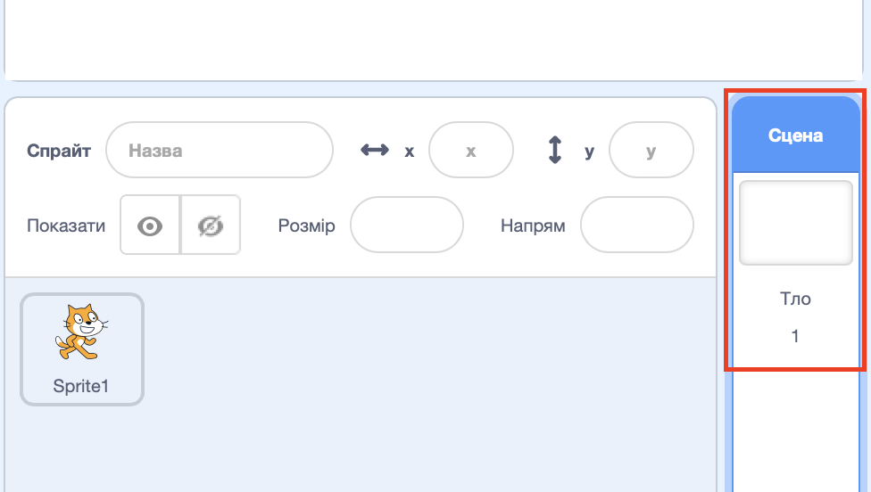
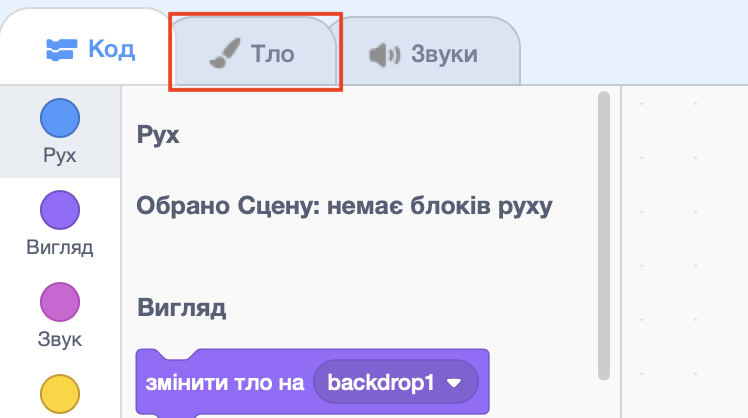
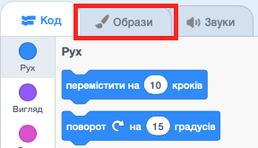

## Вибір сцени

У Скретч є бібліотека фонових зображень та спрайтів для того, щоб твій проєкт виглядав чудово.

--- task ---

Вибір Сцени.

Клікни на **Тло**.

Клікни по іконці **Обрати тло з бібліотеки**.

Далі вибери свій улюблений підводний фон!

--- /task ---

Чудово! Звичайно, тепер твій кіт під водою, а коти зазвичай таке не дуже люблять. Але ти можеш це виправити, тому що можеш перетворити кота на акулу!

--- task ---

Спочатку вибери спрайт кота та перейди у вкладку **Образи**.

Далі клікни **Обрати образ з бібліотеки**

Вибери зображення акули та клікни **OK**.

Тепер видали образи кота, вибираючи кожен з них і клікаючи по **x**.

--- /task ---

Тепер у тебе є акула — чудово!