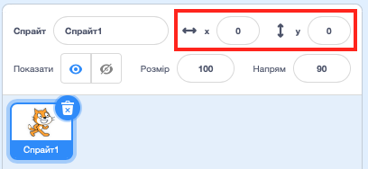

## Переміщення

Зараз твоя акула рухається по колу, але було б значно веселіше керувати нею за допомогою клавіш зі стрілками. У цій секції ти навчишся це робити!

--- task ---

Спочатку видали весь код, що в тебе є для акули.

--- /task ---

Як і до цього, тобі знадобляться блоки **Події** та **Рух**!

--- task ---

Цього разу знайди цей блок та перетягний його на панель поточного спрайта:

```blocks3
    when [пропуск v] key pressed
```

Натисни на маленьку стрілочку (▼) поруч із `пропуск`. Ти побачиш список усіх клавіш, з яких можна вибирати.

--- /task ---

Тобі знадобляться чотири блоки `коли клавішу натиснуто`{:class="block3events"} — по одному на кожну із клавіш стрілок.

--- task ---

Для того, щоб змусити акулу рухатися, приєднай ці блоки до блоків **Рух** ось так:

```blocks3
    when [стрілка ліворуч v] key pressed
    move (-10) steps
```

```blocks3
    when [стрілка праворуч v] key pressed
    move (10) steps
```

```blocks3
    when [стрілка вгору v] key pressed
```

```blocks3
    when [стрілка вниз v] key pressed
```

--- /task ---

**Примітка**: `-10` означає «повернутися назад на 10 кроків».

--- task ---

**Тест:** натисни клавіші зі стрілками вліво та вправо кілька разів, щоб перевірити свій код.

--- /task ---

Тепер твоя акула рухається назад та вперед, що дуже класно, але вона не переміщується вгору або вниз. Але якщо ти переглянеш блоки в списку **Рух**, то не побачиш нічого для переміщення вгору та вниз. Зате є купа блоків що відносяться до координат **x** та **y** – давай спробуємо їх!

--- task ---

Візьми два блоки `змінити y на`{:class="block3motion"} і онови свій код таким чином:

```blocks3
    when [стрілка вгору v] key pressed
+     change y by (10)
```

```blocks3
    when [стрілка вниз v] key pressed
+     change y by (-10)
```

--- /task ---

Зараз, коли ти натискатимеш на клавіші зі стрілками, акула буде рухатися по всій сцені!

--- collapse ---
---
title: Що таке координати x та y?
---

Коли ми говоримо про розташування спрайтів, ми часто використовуємо координати x та y. **Вісь x** координатної системи Сцени проходить **зліва направо**, а **вісь y** — **знизу вгору**.


Положення спрайта можна визначити за координатами його центру, наприклад `(15, -27)`, де `15` є положенням по осі x, а `-27` — положення по осі y.

+ Щоб розібратися в цьому на практиці, вибери спрайт та використовуй параметри **x** та **y**, щоб переміщувати його по сцені, надаючи координатам різних значень.



+ Спробуй різні пари значень, щоб побачити, куди переміщуватиметься спрайт! У Скретч вісь x проходить від `-240` до `240`, а вісь y – від `-180` до `180`.

--- /collapse ---

### Перезапуск гри

Зараз акула рухається по всьому екрану, але уяви, що це гра: як ти її перезапускатимеш і що відбуватиметься на початку кожної гри?

Коли гравець розпочинає гру, акула має повертатися у початкове положення. Гру запускатимуть, натискаючи на залений прапор, тому тобі треба буде змінювати координати акули x та y, коли це відбувається.

Насправді це дуже легко! Координати `(x, y)` центру Сцени дорівнюють `(0, 0)`.

Тобто все, що тобі треба, — блок із категорії **Події** для зеленого прапора та блок **перейти в** із категорії **Рух**.

--- task ---

Перетягни блок `коли зелений прапор натиснуто`{:class="block3events"} (**Події**) на панель поточного спрайта.

```blocks3
    when green flag clicked
```

Далі знайди блок `перейти в`{:class="block3motion"} (**Рух**) і приєднай його до твого блоку з прапором (**Події**).

```blocks3
    when green flag clicked
+     go to x: (0) y: (0)
```

Встанови обидві координати `x` та `y` в `0` за допомогою блоку `перемістити в`{:class="block3motion"}, якщо вони ще не дорівнюють `0`.

--- /task ---

--- task ---

Тепер натисни на зелений прапор: ти маєш побачити, як акула повернулася до центру сцени!

--- /task ---