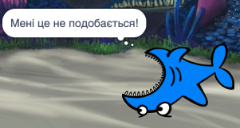

## Усі спрайти

Зараз у тебе є акула, яку ти можеш переміщувати за допомогою клавіш зі стрілками. Клас! Час додати трохи риби, яку вона б могла ловити.

\--- task \---

Натисни на кнопку **Новий спрайт** і вибери рибину на екрані, що відкриється.


Якщо твоя рибина є трохи завеликою в порівнянні із акулою, ти можеш змінити її розмір і зробити обидва спрайти правильної величини!


Зміни число в параметрі «розмір», щоб зробити спрайт більшим або меншим.

\--- /task \---

Чудово! Пізніше ти додаси код для того, щоб рибина самостійно плавала без допомоги гравця. Твій гравець керуватиме акулою і намагатиметься зловити її.

## \--- collapse \---

## title: Що робити з акулою, яка плаває хвостом вперед?

Коли акула плаває хвостом вперед, це справді виглядає трохи смішно. Ти ж зазвичай розвертаєшся, а не ходиш задом наперед, так само і акула б розверталася, а не пливла хвостом вперед. На щастя, у Скретч є для цього блок!

Блок `повернути в напрямку`{:class="block3motion"} дозволяє тобі вибрати, куди повернутий твій спрайт. Ти знайдеш його в розділі **Рух**. Ти можеш ввести довільну кількість градусів для того, щоб направити спрайт саме туди, куди треба.

\--- /collapse \---

\--- task \---

Візьми пару блоків `повернути в напрямку`{:class="block3motion"} зі списку **Рух** і приєднай їх до коду акули таким чином:

```blocks3
    коли клавішу [стрілка ліворуч v] натиснуто
+ повернути в напрямку (-90)
  перемістити на (10) кроків
```

```blocks3
    коли клавішу [стрілка праворуч v] натиснуто
+ повернути в напрямку (90)
  перемістити на (10) кроків
```

\--- /task \---

\--- task \---

Зміни кількість кроків у блоках `перемістити на`{:class="block3motion"} з `-10` на `10`.

Якщо ти спробуєш перемістити акулу зараз, після того як ти додав(-ла) блоки `повернути в напрямку`{:class="block3motion"}, то ти можеш помітити щось трохи дивне. Акула може повертатися не зовсім правильно!



\--- /task \---

## \--- collapse \---

## title: Чому вона плаває черевцем догори?

Проблема тут полягає в тому, що спочатку в спрайті акули, як і в інших спрайтах, встановлено **стиль обертання** "навколо", а тобі треба буде використовувати стиль "зліва-направо".

Як завжди, для цього існує свій блок, і він знаходиться в розділі **Рух**!

\--- /collapse \---

\--- task \---

Пошукай в категорії **Рух** блок `стиль обертання`{:class="block3motion"}.

Додай цей блок до коду відновлення акули, який було створено раніше, і задай стиль обертання `зліва-направо`{:class="block3motion"} ось так:

```blocks3
    when green flag clicked
+    set rotation style [зліва-направо v]
    go to x: (0) y: (0)
```

\--- /task \---