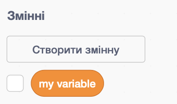
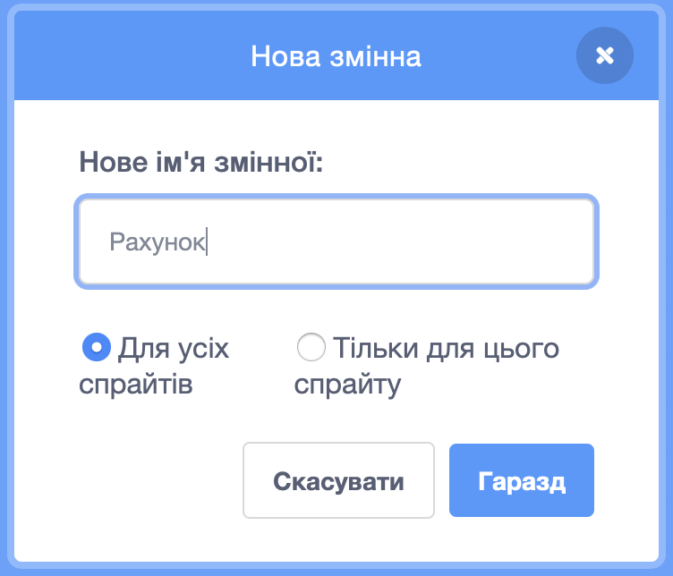
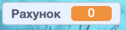

## Ведення рахунку

Для підрахунку кількості рибин, яку гравець упіймав, тобі треба десь зберігати рахунок, якось його змінювати та обнуляти, коли гра перезапускається.

Крок перший: зберігання рахунку!

\--- task \---

Перейди в категорію блоків **Змінні** і натисни **Створити змінну**.



Назви змінну `Рахунок`.



Створи нову змінну!



\--- /task \---

## \--- collapse \---

## title: Що таке змінні?

Коли ти хочеш зберегти інформацію в програмі, ти можеш використовувати **змінну**. Можеш уявити її як підписану коробку: ти можеш покласти щось в неї, перевірити її вміст або змінити його. Ти можеш побачити змінні в розділі **Змінні**, але спочатку треба їх створити, щоб вони там відобразилися!

\--- /collapse \---

Тепер тобі треба оновлювати змінну, коли акула їсть рибу, а також обнуляти її, коли гра перезапускається. І перше, і друге є досить простим:

\--- task \---

Із розділу **Змінні** візьми блоки `надати [my variable v] значення [0]`{:class="block3variables"} і `змінити [my variable v] на [1]`{:class="block3variables"}. Натисни на маленькі стрілочки в цих блоках, вибери `Рахунок` зі списку, а потім розмісти їх в своїй програмі:

### Код для акули

```blocks3
    коли ⚑ натиснуто
+ надати [Рахунок v] значення [0]
  стиль обертання [зліва-направо v]
  перемістити в x: (0) y: (0)
```

### Код для риби

```blocks3
    якщо <торкається [Sprite1 v] ?> то 
+  змінити [Рахунок v] на [1]
  сховати
  чекати (1) секунд
  перемістити в x: (випадкове від (-240) до (240)) y: (випадкове від (-180) до (180))
  показати
end
```

\--- /task \---

Клас! Тепер у тебе є свій рахунок.