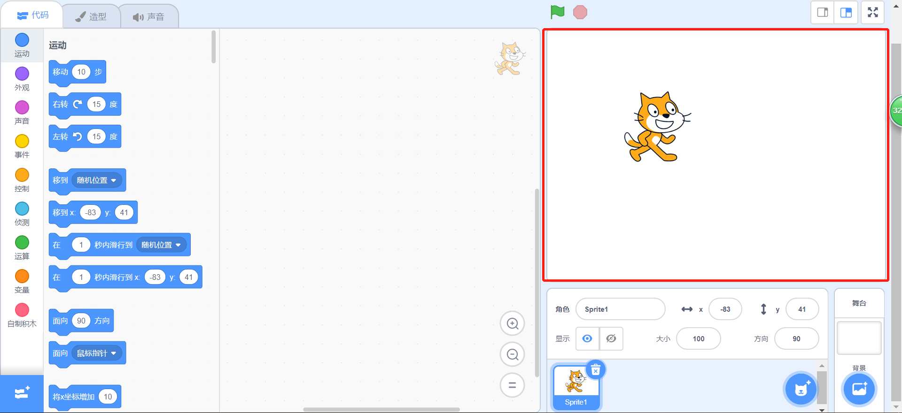
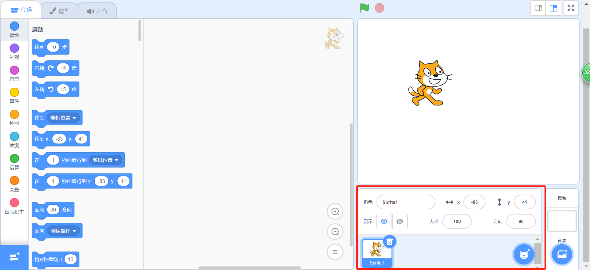
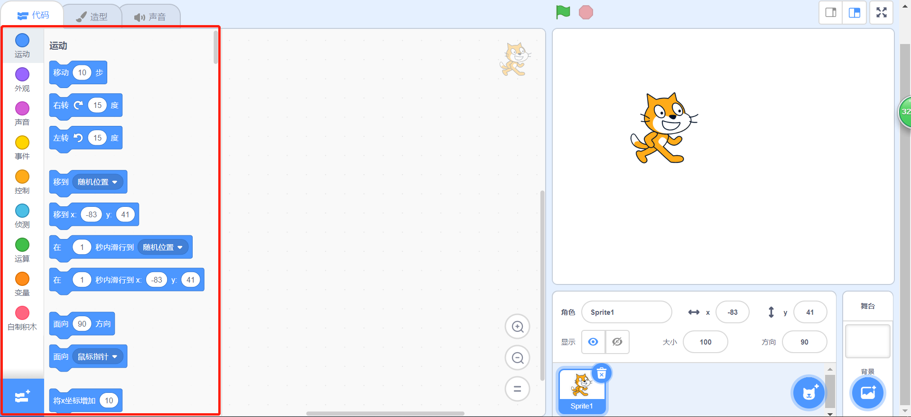
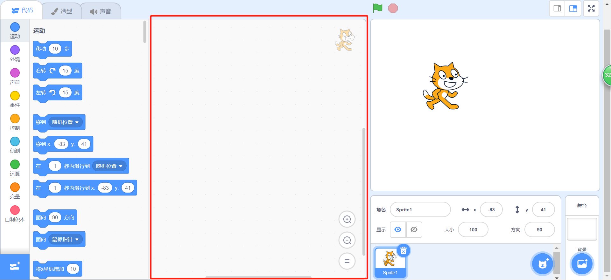

## 调整设置

打开Scratch后，您会看到一个类似于下面的窗口。

\--- task \---

查看以下每个区域，并记住它们的位置。

\--- /task \---

### 舞台



## \--- collapse \---

## title: 舞台是什么？

舞台是您的Scratch程序运行的地方。 包括：

* 一个或多个**背景** \(屏幕背景上的图像\)

* 任何与之关联的**代码块**\（后文会涉及\）

\--- /collapse \---

### 角色列表



## \--- collapse \---

## title: 什么是角色？

您可以在舞台上添加的任何事物都是**角色** 。

一个角色包括：

* 在舞台上的**图像**
* 任何角色额外的 **造型** \(外观\)
* 任何与它相关联的 **声音**
* 任何与它相关联的 **代码块** 

\--- /collapse \---

### 代码块面板



## \--- collapse \---

## title: 代码块

Scratch中代码的形式是连接为程序的积木块。 您可以从**代码块面板** 选择积木，将它们拖到**当前角色面板**中 ，然后将它们彼此连接起来。

共有十种类别的代码块。 它们采用了颜色编码，您可以通过单击**代码块面板**顶部列表中的单项在它们之间进行选择。

\--- /collapse \---

### 当前角色面板



## \--- collapse \---

## title: 当前角色是什么？

**当前角色**即是从**角色列表**中选择的那个 。

在**当前角色面板**您可以看到所选角色的代码、造型和声音的地方。

\--- /collapse \---

该编码了！

\--- task \---

在角色列表中，点击Scratch Cat。 猫即是当前角色。

在代码块面板中选择**事件**类别，点击`当旗帜被点击`{:class="block3events"}模块并将其拖动到当前角色面板中。

```blocks3
    when green flag clicked
```

\--- /task \---

\--- task \---

然后转到**外观**代码块面板中找到以下块：

```blocks3
    say [Hello!] for (2) secs
```

点击它，按住鼠标按钮，然后将其拖动到当前角色面板后松开鼠标。

\--- /task \---

\--- task \---

第二个代码块现在也被添加到当前角色面板上了，我们再点击并拖动它，将其移动到第一个代码块底部，让他们连接到一起。 像这样：


\--- /task \---

\--- task \---

现在点击 **绿色小旗** 开始你的程序并观看发生了什么！

\--- /task \---