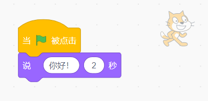

## 调整设置

\--- task \---

Open a [new Scratch project](https://rpf.io/scratch-new){:target="_blank"}. Scratch will open in another browser tab.

[[[working-offline]]]

\--- /task \---

Once you open Scratch, you’ll see a window like the one below.

\--- task \---

Look for each of the following areas and remember where they are.

\--- /task \---

### 舞台


## \--- collapse \---

## title: 舞台是什么？

This is where your Scratch programs run. It has:

* 一个或多个**背景** \(屏幕背景上的图像\)

* 任何与之关联的**代码块**\（后文会涉及\）

\--- /collapse \---

### 角色列表


## \--- collapse \---

## title: 什么是角色？

Any item you can add on the Stage is a **sprite**.

A sprite includes:

* 在舞台上的**图像**
* 任何角色额外的 **造型** \(外观\)
* 任何与它相关联的 **声音**
* 任何与它相关联的 **代码块** 

\--- /collapse \---

### 代码块面板


## \--- collapse \---

## title: 代码块

Code in Scratch comes in the form of blocks that you connect to make programs. You choose blocks from the **code blocks palette**, drag them into the **current sprite panel**, and then connect them to each other.

There are ten categories of blocks. They are colour-coded, and you can choose between them by clicking on the items in the list at the top of the **code blocks palette**.

\--- /collapse \---

### 当前角色面板


## \--- collapse \---

## title: 当前角色是什么？

The **current sprite** is the one that's selected in the **sprite list**.

The **current sprite panel** is where you can see the code, costumes, and sounds for the selected sprite.

\--- /collapse \---

Time to get coding!

\--- task \---

In the sprite list, click on the Scratch Cat. The cat is now the current sprite.

Choose the **Events** category in the code blocks palette, click the `when flag clicked`{:class="block3events"} block, and drag it into the current sprite panel.

```blocks3
    when green flag clicked
```

\--- /task \---

\--- task \---

Then go to **Looks** in the code blocks palette and find this block:

```blocks3
    say [Hello!] for (2) secs
```

Click on it, hold down the mouse button, and then just drag it into the current sprite panel and let go of the button.

\--- /task \---

\--- task \---

Now that the second block is in the current sprite panel, connect it to the bottom of the first block by clicking and dragging it again to move it below the other block until they snap together, like this:



\--- /task \---

\--- task \---

Now click the **Green Flag** to start your program and watch what happens!

\--- /task \---