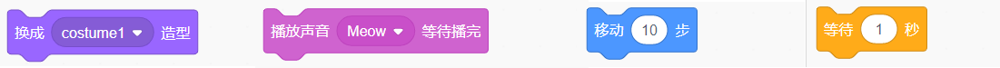
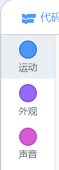
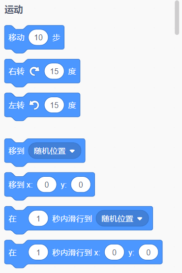
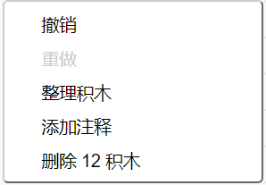

## Adding and removing code blocks

Great! You’ve written your very first Scratch program. Time to learn a little more about getting code in and out of Scratch! Scratch code is made up of **blocks** such as these:



You will find all blocks in the **code blocks palette**, sorted into different categories according to what they do.

## \--- collapse \---

## title: Using blocks from the different categories

Click on a category name to see the blocks in that category. Here, the **Motion** category is selected:



All of the blocks in the category you've clicked are shown in a list:



You can click on the blcok you want, and then just drag it into the current sprite panel and let go. Once it's in the panel, you can move it around and connect it to other blocks.

\--- /collapse \---

If you want to see what a block does, you can double-click on it to make it run!

\--- task \---

Try double-clicking on some of the blocks to see what they do.

\--- /task \---

## \--- collapse \---

## title: Running the code

Usually, you want your code to run automatically whenever something specific happens. This is why many of your programs will start with a block from the **Events** category, most often this one:

```blocks3
    when green flag clicked
```

The code blocks connected to this block will run after the **green flag** is clicked.

Code blocks run from top to bottom, so the order in which you snap your blocks together matters. In this example, the sprite will `say`{:class="block3looks"} `Hello!` before it will `play`{:class="block3sound"} the `meow` sound.

```blocks3
    when green flag clicked
    say [Hello]
    play sound [meow v]
```

\--- /collapse \---

Removing or deleting code blocks you don’t want in your program is easy! Just drag them back into the code blocks palette.

**Be careful:** dragging them into the code blocks pallette will delete all the blocks connected to the block you drag, so make sure to separate code blocks you want to keep from those you want to remove. If you delete some code blocks by accident and want to get them back, right-click and then click on the **undo** option to get everything back.



\--- task \---

Try adding, deleting, and undeleting some code blocks!

\--- /task \---

### 放在一起

我们学会了如何移动代码块，并且通过运行代码实现一些操作。接下来我们来试试如何让Scratch猫绕圈行走吧！

\--- task \---

首先选择猫作为要编辑的角色，然后将下面这些代码块拖动到角色编辑面板中，并将它们连接到一起。 代码块在**事件**和**运动**类列表中。

```blocks3
    when green flag clicked
    move [10] steps
```

\--- /task \---

\--- task \---

现在，单击舞台上方的绿色小旗。


\--- /task \---

这只猫会沿着直线行走……嗯......这和我们的想法不太一样对吧？

注意：如果您单击小绿旗太多次猫走远了，可以用鼠标将它拖动回去！

\--- task \---

把右转或左转代码块加到之前的代码下边，小猫就可以绕圈行走了。 这也在**动作**类列表中。

```blocks3
    when green flag clicked
    move [10] steps
+    turn cw (15) degrees
```

\--- /task \---

## \--- collapse \---

## title: 右转或左转是怎么回事？

每个圆有360度，这个代码块让角色转动15度。 您可以通过单击数字并输入新值来更改猫转动的度数和行走的步数。


\--- /collapse \---

\--- task \---

记得保存！

\--- /task \---