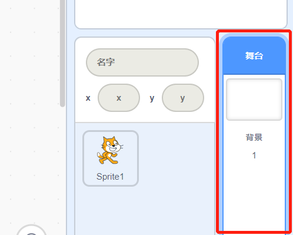
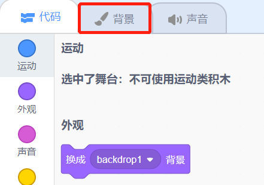
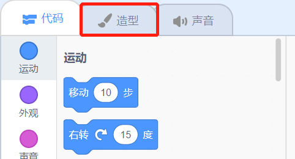

## 场景设置

Scratch有一个背景和角色库，可以让您的项目看起来更漂亮。

\--- task \---

选择舞台.

点击**背景** 。

点击**从库中选择背景**图标。

然后选择你最喜欢的水下背景！

\--- /task \---

好赞！ 现在您的猫在水里，然而，猫儿通常不怎么喜欢水。 但是您可以解决这个问题，因为您可以将猫变成鲨鱼！

\--- task \---

首先点击猫这个角色，然后点击**造型**选项卡。

之后，点击**从库中选择造型**

选择鲨鱼图像并点击 **OK**。

最后选择所有猫的造型并依次点击** x**来删除它们 。

\--- /task \---

现在你有一只鲨鱼了——优秀！