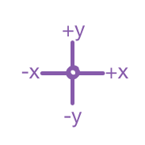
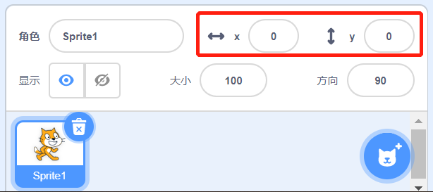

## 让角色四处移动

您的鲨鱼现在可以围成一圈移动，如果能用箭头键控制它的话会更加有趣。 这一步就教您如何做到！

\--- task \---

首先删除所有有关鲨鱼的代码。

\--- /task \---

您可能已经猜到了，您又需要用到**事件**和**运动**代码块了！

\--- task \---

这次，查找此块并将其拖动到当前角色的面板中：

```blocks3
    when [space v] key pressed
```

点击`空格`旁边的小箭头(▼)。 会出现一个包含所有按键的下拉菜单可供选择。

\--- /task \---

您一共需要4个`当按下   键`{:class="block3events"} 代码块——给每个方向箭头使用一个。

\--- task \---

想要让鲨鱼移动，需要将这些代码块像这样连接到**运动**代码块上：

```blocks3
    when [left arrow v] key pressed
    move (-10) steps
```

```blocks3
    when [right arrow v] key pressed
    move (10) steps
```

```blocks3
    when [up arrow v] key pressed
```

```blocks3
    when [down arrow v] key pressed
```

\--- /task \---

**注意**：`-10`表示“后退10步”。

\--- task \---

单击绿色小旗标志来测试您的代码。

\--- /task \---

现在鲨鱼可以前后移动了，但还不能上下移动。 而且，**运动**代码块中也并没有用于“上”或“下”的块。 但我们有一整套关于**x**和**y**坐标的操作——让我们试试吧！

\--- task \---

拖两个`将y坐标设为 `{:class="block3motion"} 的代码块，并按如下所示更新您的代码：

```blocks3
    when [up arrow v] key pressed
+     change y by (10)
```

```blocks3
    when [down arrow v] key pressed
+     change y by (-10)
```

\--- /task \---

现在当您再按方向键时，鲨鱼就可以在这个舞台上四处移动了！

## \--- collapse \---

## title: x和y坐标的工作原理是什么？

当谈及事物（比如角色）的位置时，我们通常用x和y坐标。 在舞台坐标系统中** x轴**表示从**左到右**的位置，** y轴**表示从**底部到顶部**的位置。



一个角色可以通过其中心坐标来定位，例如`(15, -27)`，其中`15`是X轴沿线的位置，`-27`是其在y轴沿线的位置。

+ 要了解其实际的工作原理，可以选择一个角色然后通过设定不同** x **和** y **坐标的值使它在舞台上移动。



+ 尝试不同的值，看看角色的去向！ 在Scratch中，x轴的范围从`-240`到`240`，y轴从`-180`到`180`。

\--- /collapse \---

### 重新启动游戏

鲨鱼现在可以在屏幕上移动了，但想象这是一个游戏的话：你该如何重启它？每次游戏开始时会发生什么情况？

当玩家开始游戏时，您需要把鲨鱼放回到最开始的位置。 玩家通过点击绿旗开始游戏，所以当这种情况发生时，您需要改变鲨鱼的x和y坐标使它归位。

这其实很简单！ 舞台的中心在`（x，y）`坐标中是`（0，0） `。

所以您只需那个绿色旗帜的 **事件** 块，和**运动**代码块中的**移动到**。

\--- task \---

拖拽一个`当绿旗被点击`{:class =“block3events”} 的**事件**块到当前角色面板。

```blocks3
    when green flag clicked
```

然后找到`移动到 `{:class =“block3motion”} **动作**块，并将其连接到绿旗**事件**块下方。

```blocks3
    when green flag clicked
+     go to x: (0) y: (0)
```

如果`移动到 `{:class="block3motion"}块中的 `x`和`y`坐标尚未归零，则将它们都设定为`0`。

\--- /task \---

\--- task \---

Now click the green flag: you should see the shark return to the centre of the stage!

\--- /task \---