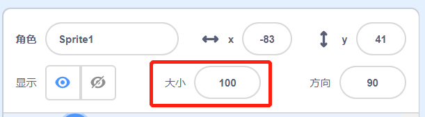
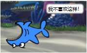

## 全部角色

现在，您有一条可以使用方向键控制其移动的鲨鱼了。 太棒了！ 该添加一些鱼让鲨鱼来捕食了。

\--- task \---

点击**新角色**按钮，然后在打开的屏幕上选择一条鱼。


如果鱼和鲨鱼相比有点大，您可以使用大小控制来使这两个角色都变成合适的大小！



Change the number in the size control to make the sprite bigger or smaller.

\--- /task \---

好赞！ 稍后我们将添加一些代码，让鱼在没有玩家控制的情况下自行移动。 玩家将移动鲨鱼来捕食小鱼。

## \--- collapse \---

## title: 鲨鱼向后游动怎么办？

鲨鱼向后游动确实有些奇怪。 就像人通常会转身而不是倒着走一样，鲨鱼也会转身而不是倒着向后游。 幸运的是，Scratch为此准备了一个代码块！

`面向 方向` {:class =“block3motion”}代码块可以帮助您选择角色面向的方向。 这个代码块在**运动**类别里。 您可以输入任意数值的角度，让角色面向任何你想要的方向。

\--- /collapse \---

\--- task \---

从**动作**{:class =“block3motion”}分类下拖动两组`面向  方向` 代码块，并将它们连接到鲨鱼的代码，如下所示：

```blocks3
    when [left arrow v] key pressed
+     point in direction (-90)
    move (10) steps
```

```blocks3
    when [right arrow v] key pressed
+     point in direction (90)
    move (10) steps
```

\--- /task \---

\--- task \---

将`移动`{:class="block3motion"} 块中的数字从`-10`更改为`10`。

在添加了`面向  方向`{:class="block3motion"}代码块后，如果你尝试移动鲨鱼，可能会发现有点奇怪。 鲨鱼转的方式好像有点不太对劲！



\--- /task \---

## \--- collapse \---

## title: 为什么鲨鱼会上下颠倒？

出现这个问题的原因是，和所有角色一样，鲨鱼一开始使用的是“任意方向”的**旋转样式** ，而您需要的是“左右”样式。

别着急，在**运动**中有一个代码块可以解决！

\--- /collapse \---

\--- task \---

在**运动**类别中找到`将旋转方式设为`{:class="block3motion"}代码块。

将代码块添加到之前添加的鲨鱼重置代码组中，并将旋转风格设置为 `左右翻转`{:class="block3motion"}，就像这样：

```blocks3
    when green flag clicked
+     set rotation style [left-right v]
    go to x: (0) y: (0)
```

\--- /task \---