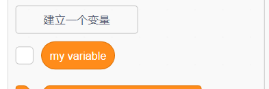
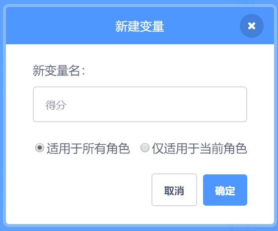
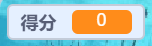

## 计分

要计算玩家捉到了多少条鱼，您首先需要某个地方来显示分数，一个加分的方法，以及当游戏重启时重置分数的方式。

首先：保存分数！

\--- task \---

点击 **变量**类列表中的 **建立一个变量**。



在名称处输入`分数`。



查看你的新变量！



\--- /task \---

## \--- collapse \---

## title: 什么是变量？

如果想要将信息存储在一个程序中，我们需要使用到一个叫做**变量**的东西。 可以把它想像为一个带标签的箱子：您可以放东西进去，检查里边是什么，或者更改里边的东西。 您可以在**变量**部分找到变量，但使用之前您需要先创建一个变量才能显示出来！

\--- /collapse \---

现在您需要在鲨鱼吃小鱼时更新变量，并在游戏重启时重置变量。 这两件事都很容易：

\--- task \---

从**变量**类列表中选择`将[我的变量]设为[0]`{:class="block3variables"}和`将[我的变量]增加[1]`{:class="block3variables"}代码块。 点击代码块中的小箭头，从列表中选择 `得分` 然后将代码块放入您的程序：

### 鲨鱼的代码

```blocks3
    when green flag clicked
+    set [score v] to [0]
    set rotation style [left-right v]
    go to x: (0) y: (0)
```

### 鱼的代码

```blocks3
    if <touching [Sprite1 v] ?> then
+        change [score v] by [1]
        hide
        wait (1) secs
        go to x: (pick random (-240) to (240)) y: (pick random (-180) to (180))
        show
    end
```

\--- /task \---

酷！ 现在，您已经有分数和其他所有内容。