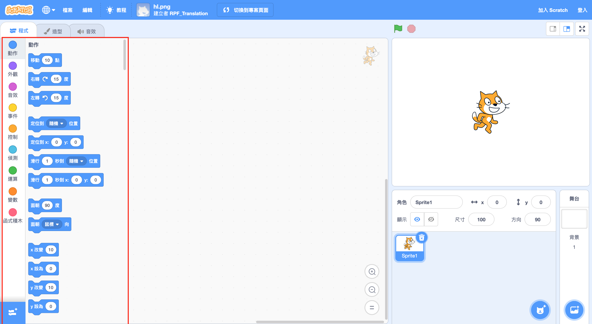
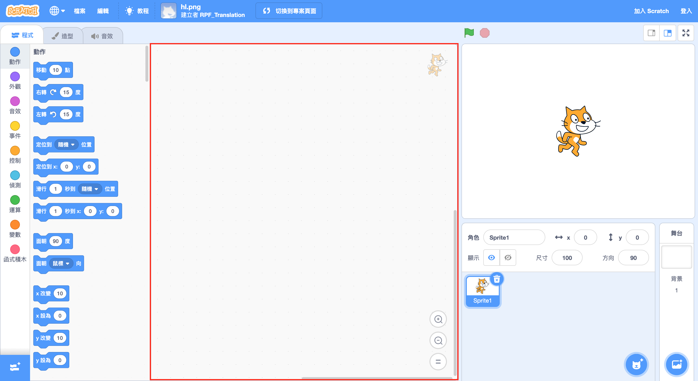
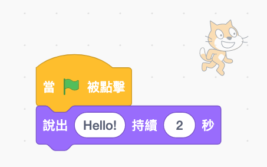

## 開始設置

打開Scratch後，您會看到一個類似於下面的視窗。

\--- task \---

查看以下每個區域，並記住它們的位置。

\--- /task \---

### 舞臺


## \--- collapse \---

## 標題：什麼舞台？

這是您的Scratch程序運行的地方。 它有

* 一個或多個**背景** \(螢幕背景上的圖像\)

* 任何與之關聯的**代碼積木**\(我們將會了解這個\)

\--- /collapse \---

### The sprite list


## \--- collapse \---

## 標題：什麼是角色？

任何您可以在舞台上添加的東西都是**角色** 。

一個角色包括：

* 在舞台上**圖像**
* 任何其他的**造型** \(外觀\)
* 任何跟它相關的**聲音**
* 任何與它相關的**代碼積木** 

\--- /collapse \---

### 代碼積木面板



## \--- collapse \---

## 標題：代碼積木

Scratch中的代碼是以積木的樣子，連結起來形成程序。 您可以從**代碼積木面板**中選擇積木 ，將它們拖曳到**當前角色面板**中 ，然後將它們彼此連接。

有十種不同種類的積木。 它們採用了顏色編碼，您可以通過點擊在**代碼積木面板**頂部，列表中的項目，在它們之間進行選擇。

\--- /collapse \---

### 當前角色面板



## \--- collapse \---

## title：當前的角色是什麼？

**當前角色**是在**角色列表**中被選中的那個。

在**當前角色面板**您可以查看所選角色的代碼，造型和聲音。

\--- /collapse \---

是時候開始編碼了！

\--- task \---

在角色列表中，點擊Scratch貓。 現在貓是當前角色了。

Choose the **Events** category in the code blocks palette, click the `when flag clicked`{:class="block3events"} block, and drag it into the current sprite panel.

```blocks3
    when green flag clicked
```

\--- /task \---

\--- task \---

Then go to **Looks** in the code blocks palette and find this block:

```blocks3
    say [Hello!] for (2) secs
```

Click on it, hold down the mouse button, and then just drag it into the current sprite panel and let go of the button.

\--- /task \---

\--- task \---

Now that the second block is in the current sprite panel, connect it to the bottom of the first block by clicking and dragging it again to move it below the other block until they snap together, like this:



\--- /task \---

\--- task \---

Now click the **Start Program** button and watch what happens!

\--- /task \---