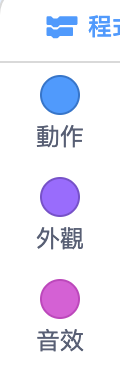
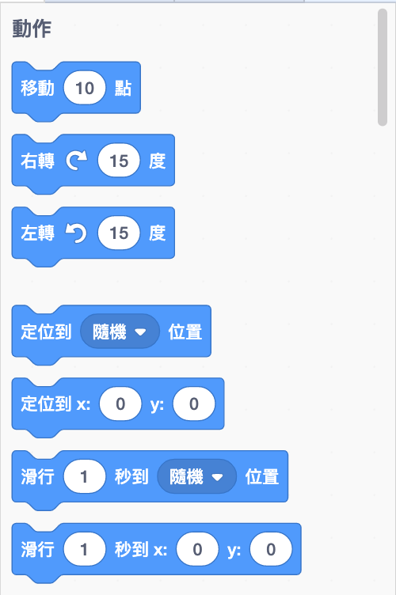
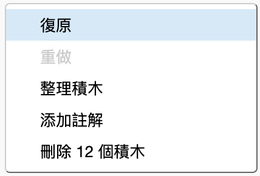

## 添加和刪除代碼積木

太好了！ 您已經編寫了第一個Scratch程序。 是時候學習更多有關編寫Scratch代碼的知識了！ Scratch代碼是由**積木**組成的，例如：


您會在**代碼積木面板**中找到所有的積木 ，根據他們的工作分為不同的類別。

--- collapse ---
---
title：使用來自不同類別的積木
---
點擊類別名稱以查看該類別中的積木。 這裡選擇了**動作**類別：



在您點擊類別後將顯示該類別中所有的積木：



您可以點擊您想要的積木並將其拖曳到當前角色面板中並放開。 一旦積木在面板中，就可以移動它並與其他積木相連接。

--- /collapse ---

如果要查看積木的功能，您可以雙擊它來運行！

--- task ---

嘗試雙擊某些積木來查看它們的功能。

--- /task ---

--- collapse ---
---
title：運行代碼
---
通常，您會希望代碼在特定情況下自動運行。 這就是為什麼許多程序都是從**事件**類別裡的積木當起頭的原因，最常見的是：

```blocks3
    when green flag clicked
```

連接到這塊積木後面的積木將會在按下**綠色旗標**之後運行。

代碼積木是從上到下運行的，因此將代碼積木組合在一起的順序很重要。 在這個範例中，角色會在`播放`{:class=“block3sound”}`meow`音效之前`說出`{:class=“block3looks”}`您好!`。

```blocks3
    when green flag clicked
    say [Hello]
    play sound [meow v]
```

--- /collapse ---

在您的程序中移除或刪除你不需要的代碼積木是很容易的！ 只需將它們拖曳回代碼積木面板就可以了。

**注意**將不需要的積木拖回代碼積木面板會將所有跟它相連的積木一起刪除，所以請確保將要保留的代碼塊與要刪除的代碼塊分開。 如果您不小心刪除了一些代碼積木並想復原，請點擊右鍵，然後點擊**復原**選項讓一切恢復原。



--- task ---

嘗試添加，刪除和取消刪除一些代碼積木！

--- /task ---

### 把它們結合

現在您知道如何移動並運行代碼了，現在是時候創建一個程序來使Scratch 貓繞圈行走了！

--- task ---

確保在“角色”列表中選擇了貓角色，然後將下面這塊積木拖曳到“角色”面板中並進行連接。 您可以在**事件**以及**動作**列表中找到它們。

```blocks3
    when green flag clicked
    move [10] steps
```

--- /task ---

--- task ---

現在，單擊舞台上方的綠色旗標。


--- /task ---

您應該看到貓直線行走……不完全是您想要的對吧？

注意：如果您點擊該旗標太多次，並且貓走偏了，則可以將其拖曳回去！

--- task ---

將轉彎積木連接到底部，以使貓角色可以繞圈行走。 它也是在**動作**列表中。

```blocks3
    when green flag clicked
    move [10] steps
+    turn cw (15) degrees
```

--- /task ---

--- collapse ---
---
title：轉彎是如何運作的？
---
這塊積木讓角色旋轉15度，而360度為一整個圓。 您可以通過點擊數字並輸入新的值來更改該數字和步數。


--- /collapse ---

--- task ---

現在保存您的工作！

--- /task ---