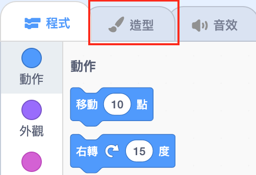

## 設定場景

Scratch有一個背景資料庫和角色庫，可讓您的項目看起來更棒。

\--- task \---

選擇舞台。

點擊**背景** 。

點擊**選個背景**按鈕。

然後選擇您最喜歡的水中背景！

\--- /task \---

太好了！ 當然，現在您在水下有一隻貓，而貓通常不那麼喜歡它。 但是您可以解決此問題，因為您可以將貓變成鯊魚！

\--- task \---

首先，選擇貓角色，然後點擊**造型**標籤。

然後單擊**選個角色**

選擇此鯊魚圖像，然後單擊**確定** 。

現在，透過選擇每個貓的造型並點擊**x**來刪除它們。

\--- /task \---

現在，您有一條鯊魚–很棒！