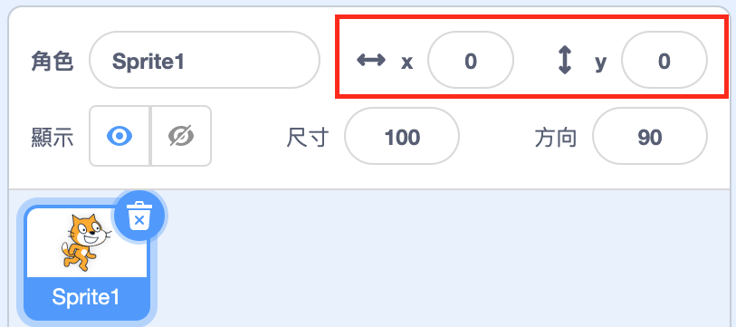

## 四處移動

現在，您的鯊魚會繞圈移動，如果能用方向鍵控制它一定會更加有趣。 在這一頁，您將學習怎麼動手做！

\--- task \---

首先刪除所有有關鯊魚的代碼。

\--- /task \---

您可能已經猜到了，您將再次用到**事件**和**動作**積木！

\--- task \---

這次，找到這塊積木並將其拖曳到當前角色面板中：

```blocks3
    when [space v] key pressed
```

點擊`空白`旁邊的小箭頭(▼)。 您將會看到所有可以選擇的鍵盤按鍵。

\--- /task \---

您會需要四個`當鍵被按下` {:class=“block3events”}積木-分別對應四個方向鍵。

\--- task \---

為了要移動鯊魚，請將這些積木連接到**動作**積木，像是這樣：

```blocks3
    when [left arrow v] key pressed
    move (-10) steps
```

```blocks3
    when [right arrow v] key pressed
    move (10) steps
```

```blocks3
    when [up arrow v] key pressed
```

```blocks3
    when [down arrow v] key pressed
```

\--- /task \---

**注意** ：`-10`表示“返回10步”。

\--- task \---

Now click the green flag to test out your code.

\--- /task \---

現在，您的鯊魚能前後移動了，這很酷吧，但它還不會上下移動。 另外，如果您瀏覽**動作**積木，您會看到沒有用於“上”或“下”的積木。 而是有一大堆關於**x**和**y**座標的積木-讓我們來試試看！

\--- task \---

使用兩個`y改變` {:class=“block3motion”}積木，並像這樣更新您的代碼：

```blocks3
    when [up arrow v] key pressed
+     change y by (10)
```

```blocks3
    when [down arrow v] key pressed
+     change y by (-10)
```

\--- /task \---

現在，當您按下方向鍵時，鯊魚就會在舞台上四處移動！

## \--- collapse \---

## 標題：x和y坐標是如何運作的？

為了討論像是角色之類的對象的位置，我們經常使用x和y坐標。 舞台座標系統的**x軸**位置是從**左到右**，**y軸**是從**底部到頂端** 。


角色可以透過它的中心坐標點來定位它的位置，例如`(15，-27) ` ，其中`15`是其沿x軸方向的位置，然後`-27`是沿y軸方向的位置。

+ To get a feel for how this actually works, select a sprite and use the **x** and **y** controls to move it around the stage by setting different values for the coordinates.



+ 嘗試不同的值，來查看角色的位置！ 在Scratch中，x軸從`-240`開始至`240` ，然後y軸是從`-180`開始至`180` 。

\--- /collapse \---

### 重新開始遊戲

The shark moves all over the screen now, but imagine this is a game: how do you restart it, and what happens at the start of each game?

You need to get the shark to its original location when the player starts the game. They'll start this game by clicking on the green flag, so you need to change the shark sprite's x- and y-coordinates when that happens.

That’s actually pretty easy! The centre of the stage is `(0, 0)` in `(x, y)` coordinates.

So all you need is an **Event** block for that green flag, and the **go to** block from **Motion**.

\--- task \---

Drag a `when green flag clicked`{:class="block3events"} **Event** block onto the current sprite panel.

```blocks3
    when green flag clicked
```

Then find the `go to`{:class="block3motion"} **Motion** block, and attach it to your flag **Event** block.

```blocks3
    when green flag clicked
+     go to x: (0) y: (0)
```

Set the both the `x` and the `y` coordinate to `0` in the `go to`{:class="block3motion"} block if they are not already `0`.

\--- /task \---

\--- task \---

Now click the green flag: you should see the shark return to the centre of the stage!

\--- /task \---