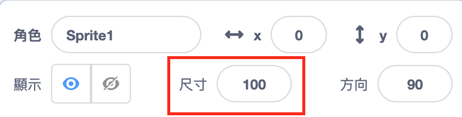

## 所有的角色

現在您有了一條鯊魚，可以使用方向鍵來回移動。 好棒棒！ 是時候添加一些魚來捕魚了。

--- task ---

點擊**選個角色**按鈕，然後在打開的螢幕上選擇一條魚。


如果您的魚比鯊魚大一點，可以使用大小控件將兩個角色的大小調整為正確的大小！



在大小控件中更改數字，以使角色尺寸變大或變小。

--- /task ---

太好了！ 接著，您將添加一些代碼，以使魚在沒有玩家幫助的情況下自行移動。 您的玩家將移動鯊魚並嘗試釣到魚。

--- collapse ---
---
title：向後游的鯊魚？
---

鯊魚向後游泳確實有點好笑。 就像您通常會轉身而不是向後走一樣，鯊魚會轉身而不是向後游泳。 幸運的是，Scratch為此提供了一個方法！

`面朝` {:class=“block3motion”}積木使您可以選擇角色指向的方向。 您會在**動作**積木類別中找到。 您可以輸入任意數量的度數，以將角色指向任意位置。

--- /collapse ---

--- task ---

從**動作**類別中取出兩個`面朝`{:class="block3motion"}積木，然後將它們連接到鯊魚的代碼中，如下所示：

```blocks3
    when [left arrow v] key pressed
+     point in direction (-90)
    move (10) steps
```

```blocks3
    when [right arrow v] key pressed
+     point in direction (90)
    move (10) steps
```

--- /task ---

--- task ---

更改`移動`{:class=“block3motion”}積木中的步數，從`-10`改成`10` 。

如果您在添加完`面朝`{:class=“block3motion”}積木後想四處移動鯊魚，您可能會注意到一些奇怪的事情。 鯊魚可能會轉向不正確的方向！


--- /task ---

--- collapse ---
---
title：為什麼顛倒了？
---

是因為鯊魚跟所有的角色的初始設定一樣，是"不設限"的**迴轉模式** ，而您需要的是改成“左-右”的設定。

像往常一樣，有一塊針對這個的積木，它在**動作**裡 ！

--- /collapse ---

--- task ---

在**動作**類別裡找到`旋轉方式設為`{:class=“block3motion”}積木。

將這個積木添加到之前做的重置代碼中，並將迴轉模式設置為`左-右`{:class=“block3motion”}，如下所示：

```blocks3
    when green flag clicked
+     set rotation style [left-right v]
    go to x: (0) y: (0)
```

--- /task ---