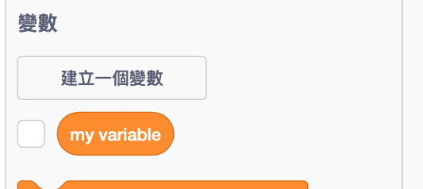
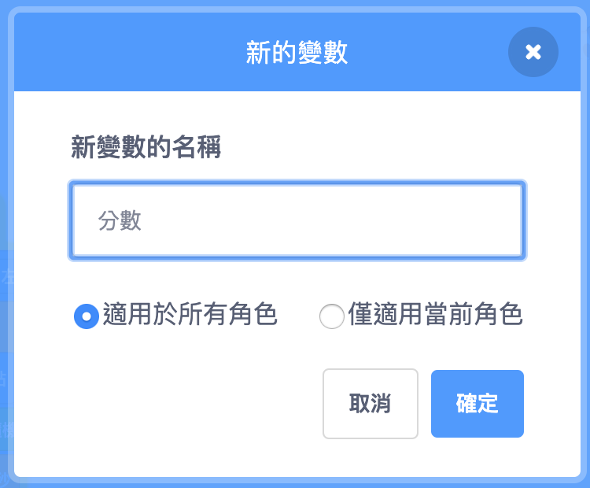
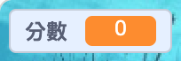

## 紀錄得分

為了要紀錄玩家捕獲到魚的分數，您需要有存儲分數的地方，增加分數的方式以及重新啟動遊戲時重置分數的方式。

第一：儲存分數！

\--- task \---

到**變數**積木類別裡點擊**建立一個變數**按鈕。



輸入`分數`作為名稱。



查看您的新變數！



\--- /task \---

## \--- collapse \---

## 標題：什麼是變數？

當您在程序中想要儲存資訊時，所要使用的東西稱為**變數** 。 可以將其想像成帶有標籤的盒子：您可以在箱子裡放一些東西，檢查裡面有什麼，然後更改裡面的東西。 您可以在**變數**類別中找到”變數“，但您需要先創建它們，然後它們才能顯示在這裡！

\--- /collapse \---

現在你需要在鯊魚吃了一條魚後，更新該變數的值，並在遊戲重新啟動時將它歸零。 兩者都非常容易：

\--- task \---

從**變數**類別中取出`變數[分數]設為[0]` {:class=“block3variables”}和`變數[分數]改變[1]` {:class=“block3variables”}兩塊積木。 接著點擊積木上的小箭頭，從列表中選擇`分數`，然後將積木放入程序中：

### 鯊魚的代碼

```blocks3
    when green flag clicked
+    set [分數 v] to [0]
    set rotation style [left-right v]
    go to x: (0) y: (0)
```

### 魚的代碼

```blocks3
    if <touching [Sprite1 v] ?> then
+        change [分數 v] by [1]
        hide
        wait (1) secs
        go to x: (pick random (-240) to (240)) y: (pick random (-180) to (180))
        show
    end
```

\--- /task \---

很酷吧！ 現在您已經有分數，一切都已就緒了。